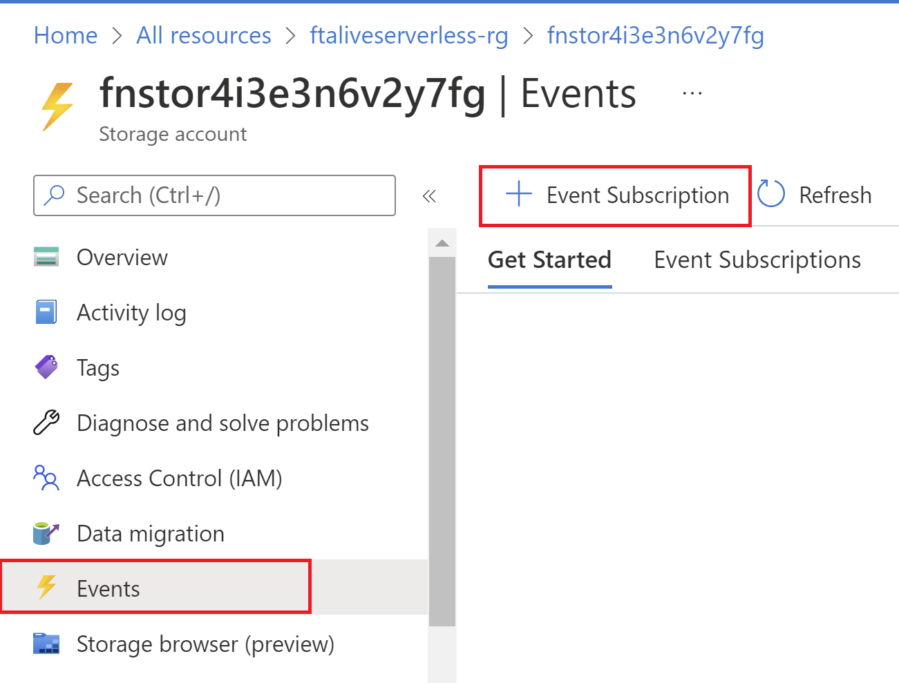
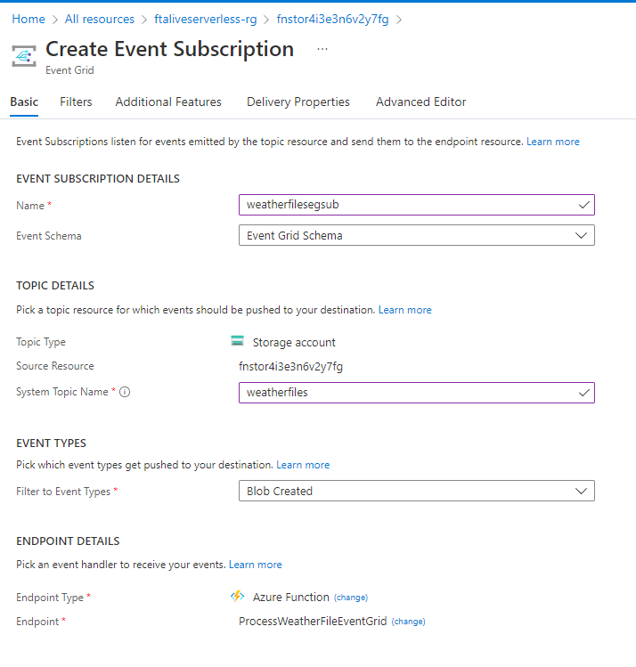
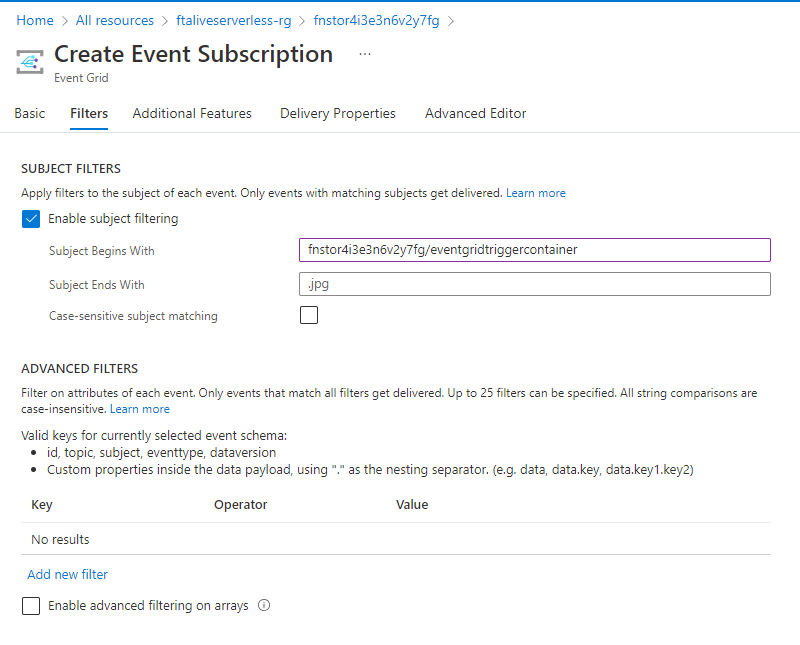

# Weather Station

Weather Station is a Function App sample that demonstrates some basic features of Azure Functions

# Features

This projects demonstates the following features:

- Integration with other Azure PaaS services (Event Hubs, Azure Cosmos DB, Event Grid)
- Using managed identities in Azure Functions.
- Monitoring Azure Functions using Application Insights.
- Creating Azure Function resources using Bicep.
- Deploy the infrastructure and code for our Azure Function using GitHub Actions.

# Prerequisites

- An Azure Subscription
- The lastest Azure CLI version installed.
- Fork this GitHub repository in your own account and with the capability of executing GitHub actions (public repository is needed for this).
- Azure Function Core Tools (Optional. Only needed if deploying the resources manually).

# Deploy 

**Option 1: Using GitHub Actions**

1. In a command prompt or in the Azure Cloud Shell, define the following environment variables:

```bash
RESOURCE_GROUP=<name-of-resource-group>
LOCATION=<azure-region-near-you>
```

2. Login to your Azure Subscription and set the subscription that you want to use for this sample:

```bash
az login
az account list -o table
az account set -n <your-subscription-id>
```

3. Create a resource group for our sample:

```bash
az group create --name $RESOURCE_GROUP --location $LOCATION
```

4. Create a Service Principal and give it acess to the resource group

```bash
az ad sp create-for-rbac --name <name-of-your-service-principal> --role Contributor --scopes <id-of-your-resource-group> --sdk-auth
```

5. This command will generate a JSON output. Copy the full output.
6. In your GitHub Repository, navigate to *Settings* > *Secrets* and select *New Repository Secret*.
7. Name the secret *AZURE_CREDENTIALS* and paste the output into the value textbox.
8. Create a new secret called *AZURE_RG* and type in the name of your resource group that you've created as the value.
9. Create a new secret called *AZURE_SUBSCRIPTION* and enter your Azure Subscription Id as the value.
10. In your GitHup Repository, navigate to *Actions* and select the *Deploy Sample* action.
11. Select *Run workflow* > *Run workflow*
12. This will start a new workflow that will deploy the necessary infrastructure and functions code in this sample.
13. Navigate to the Azure Portal and ensure that all resources have been correctly deployed.

**Option 2: Deploy manually**

To deploy the infrastructure required for this sample straight to your Azure Subscription, click the button below: 

[](https://portal.azure.com/#create/Microsoft.Template/uri/https%3A%2F%2Fraw.githubusercontent.com%2Fwillvelida%2Ffta-live-serverless-with-function-sample%2Fmain%2Fdeploy%2Fazuredeploy.json)

To deploy the Functions to your Function App, navigate to the ```src``` folder in the cloned or forked repository and run the following command:

```bash
func azure functionapp publish <FunctionAppName>
```

# Set up Event Grid Trigger

To configure the Event Grid Trigger function, we need to setup the following Event Subscription manually. In the storage account that has been created, click on *Events*. Click on *+ Event Subscription* to create a new Event Subscription:



In the *Basics* tab, configure the following settings:

- Under *Event Subscription Details*, give your subscription a name and set the *Event Schema* to *Event Grid Schema*.
- Under *Topic Details*, give your System Topic a name. 
- Under *Event Types*, filter the Event Types to *Blob Created*.
- Under *Endpoint Details*, select the *ProcessWeatherFileEventGrid* function in your deployed Function App.



In the *Filters* tab, enable subject filtering. As part of our infrastructure deployment, we created two blob containers to upload files to trigger Functions in our Function App. For our Event Grid Function, we will only trigger that function based on new files being uploaded to our ```eventgridtriggercontainer```.

In the *Subject Begins With* textbox, enter the name of your Storage Account followed by ```eventgridtriggercontainer``` in the following format:

```<storage-account-name>/eventgridtriggercontainer```



# Licence

This project is licensed under the MIT License - see the [LICENSE](./LICENSE) file for details.